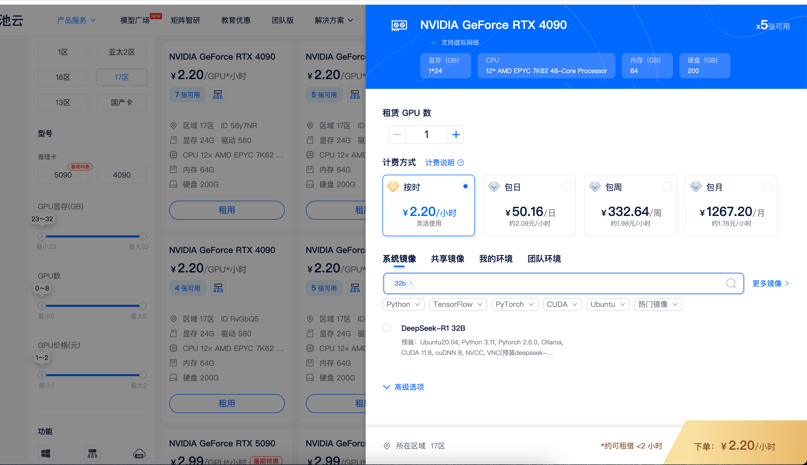

# AI Auto Annotator

基于 **NVIDIA LocateAnything-3B** 的开集图像/视频自动标注工作台。支持上传图片或视频、AI 检测、人工复核、导出 YOLO / COCO 数据集。

- 模型主页：[nvidia/LocateAnything-3B](https://huggingface.co/nvidia/LocateAnything-3B)
- 适用场景：目标检测数据标注、教学演示、YOLO/COCO 训练集导出

## 功能概览

- 项目管理：项目 → 数据集 → 上传图片/视频
- 视频拆帧：按 FPS 抽帧后批量检测
- AI 检测：LocateAnything-3B 开放词汇检测
- 人工复核：画布上编辑检测框
- 数据导出：YOLO、COCO、带框预览图
- 提示词优化：中文描述自动转英文检测提示词（需配置 LLM API Key）

## 架构

```
浏览器 → 前端 Vite (:5173)
           │  /api 代理
           ▼
        Go 后端 (:8088)
           │  HTTP
           ▼
        Python sidecar (:8001)  ← LocateAnything-3B 常驻 GPU
```

## 快速开始（推荐：云 GPU 服务器）

> 建议在矩池云 / AutoDL 等带 NVIDIA GPU 的 Linux 镜像上运行，**不建议在本机直接装整套环境**。

以矩池云为例，选择 **RTX 4090（显存 ≥ 24GB）**、按时计费即可：



### 1. 准备模型

下载 LocateAnything-3B 到本地，例如 `/mnt/LocateAnything-3B`：

```bash
pip install huggingface_hub
HF_ENDPOINT=https://hf-mirror.com huggingface-cli download nvidia/LocateAnything-3B --local-dir /mnt/LocateAnything-3B
```

> 模型约 7.3GB。若使用 HuggingFace 镜像，模型需要做 attn 适配（`infer_single.py` 与 `modeling_qwen2.py` 已内置降级到 sdpa）。


### 2. 一键安装

```bash
cd ai-auto-annotator
bash setup.sh /mnt/LocateAnything-3B
```

脚本会自动安装 Go、Python 依赖、编译后端、安装前端依赖，并生成配置文件 `backend/.env`。

### 3. 配置 LLM Key（必选）

「生成任务配置」功能需要 OpenAI 兼容的 LLM API。上一步已经生成好 `backend/.env`，用编辑器打开它，改这几行就行：

```bash
MATPOOL_KEY=填你自己的-key                                       # LLM API Key（必填）
MATPOOL_ENDPOINT=https://token.matpool.com/v1/chat/completions   # OpenAI 兼容接口地址
MATPOOL_LLM=DeepSeek-V4-Pro                                      # 模型名称
```

> `backend/.env` 已在 `.gitignore` 中，不会进入版本库，可放心填 Key。

### 4. 启动

```bash
bash start.sh
```

浏览器打开：**[http://localhost:5173](http://localhost:5173)**

停止服务：

```bash
bash stop.sh
```

首次启动 sidecar 加载模型约 1~2 分钟，看到 `loaded=true` 后再点检测。

## 环境要求


| 项      | 要求                          |
| ------ | --------------------------- |
| OS     | Linux x86_64（Ubuntu 20.04+） |
| GPU    | NVIDIA，显存 ≥ 16GB            |
| Python | 3.10 ~ 3.11                 |
| Go     | 1.22+（setup.sh 自动安装）        |
| Node   | 18+（云镜像一般自带）                |
| 磁盘     | 预留约 15GB（模型 + 依赖）           |


## 目录结构

```
ai-auto-annotator/
├── backend/              # Go REST + WebSocket 后端
│   ├── engine_python/    # Python 推理 sidecar
│   ├── cmd/server/       # 入口
│   └── internal/         # 业务逻辑
├── frontend/             # Vue 3 + Vite + Naive UI
├── setup.sh              # 一键安装
├── start.sh / stop.sh    # 启停脚本
└── environment.yml       # conda 环境（可选）
```


## 常见问题


### sidecar 连不上（8001）

```bash
bash stop.sh && bash start.sh
# 查看 logs/sidecar.log
```


### 缺少 torchvision 等依赖

```bash
bash setup.sh /mnt/LocateAnything-3B
bash stop.sh && bash start.sh
```


### 检测很慢

目标越多越慢。视频建议 **每秒 1~2 帧** 拆帧，不要每帧都跑。

## License

MIT